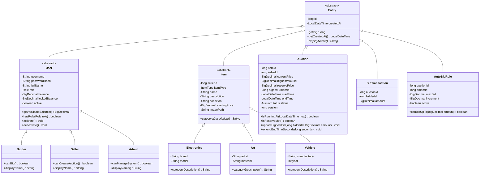

# Sơ đồ Lớp (Class Diagram) - Hệ thống Đấu giá Trực tuyến

Tài liệu này mô tả mô hình miền (domain model) và kiến trúc hệ thống của Online Auction System.

## 1. Cây kế thừa chính

Hệ thống tuân thủ nghiêm ngặt phương pháp tiếp cận OOP với các phân cấp kế thừa rõ ràng cho các thực thể miền.

## 2. Các mối quan hệ chính

- **Seller 1 ---- * Item**: Một người bán (seller) có thể đăng nhiều mặt hàng.
- **Seller 1 ---- * Auction**: Một người bán sở hữu nhiều phiên đấu giá.
- **Item 1 ---- 1 Auction**: Mỗi phiên đấu giá được liên kết với duy nhất một mặt hàng cụ thể.
- **Auction 1 ---- * BidTransaction**: Một phiên đấu giá theo dõi lịch sử của các lệnh đặt giá được chấp nhận.
- **Bidder 1 ---- * BidTransaction**: Một người đấu giá (bidder) có thể tham gia vào nhiều phiên đấu giá khác nhau.
- **Auction 1 ---- * AutoBidRule**: Nhiều người dùng có thể thiết lập giới hạn tự động đấu giá (auto-bid) cho cùng một phiên.
- **Bidder 1 ---- * AutoBidRule**: Một người dùng có thể có nhiều quy tắc tự động đấu giá trên các phiên đấu giá khác nhau.

## 3. Tổng quan Kiến trúc (N-Tier)

Dự án được cấu trúc thành ba module Maven để đảm bảo tính phân tách các mối quan tâm (separation of concerns):

1.  **`common`**: Chứa các DTO, Enum và Domain Model dùng chung. Không có phụ thuộc bên ngoài ngoại trừ Gson và Slf4j.
2.  **`server`**: "Bộ não" của hệ thống. Xử lý kết nối Socket, kiểm soát đồng thời (Concurrency), Logic nghiệp vụ và lưu trữ SQLite.
3.  **`client`**: "Giao diện". Ứng dụng JavaFX giao tiếp với server thông qua giao thức JSON.

## 4. Tầng Dịch vụ & Đồng thời (Server)

- **AuctionLockManager**: Lớp Singleton quản lý các đối tượng `ReentrantLock` cho mỗi `auctionId` bằng cách sử dụng `ConcurrentHashMap`. Đảm bảo rằng hai người đặt giá cùng một lúc cho một món hàng không ghi đè dữ liệu của nhau.
- **BidService**: Trình xử lý logic cốt lõi. Điều phối giữa các DAO, WalletService (cho Escrow) và NotificationService (cho cập nhật thời gian thực).
- **WalletService**: Quản lý hệ thống "Escrow" (Ký quỹ):
    - `lockFunds()`: Chuyển tiền từ `balance` sang `lockedBalance` khi có lệnh đặt giá.
    - `releaseFunds()`: Hoàn trả tiền cho người dùng nếu họ bị vượt giá.
    - `settle()`: Hoàn tất việc thanh toán cho người bán khi phiên đấu giá kết thúc.

## 5. Các nguyên lý thiết kế đã áp dụng

- **SOLID**:
    - **S (Single Responsibility)**: Mỗi lớp (DAO, Service, Controller) chỉ có một trách nhiệm duy nhất.
    - **O (Open/Closed)**: Các loại Item mới có thể được thêm vào mà không cần sửa đổi logic đấu giá cốt lõi (sử dụng Factory + Inheritance).
    - **D (Dependency Inversion)**: Các Service phụ thuộc vào các lớp trừu tượng (Interface DAO) thay vì các triển khai SQL cụ thể.
- **DRY (Don't Repeat Yourself)**: Các logic và model dùng chung được đặt trong module `common`.
- **Encapsulation (Đóng gói)**: Tất cả các trường dữ liệu là private với quyền truy cập được kiểm soát thông qua getter/setter và các phương thức nghiệp vụ.
- **Composition over Inheritance (Ưu tiên Thành phần hơn Kế thừa)**: Được sử dụng trong việc kết nối các Service và mối quan hệ giữa Auction và Item.
