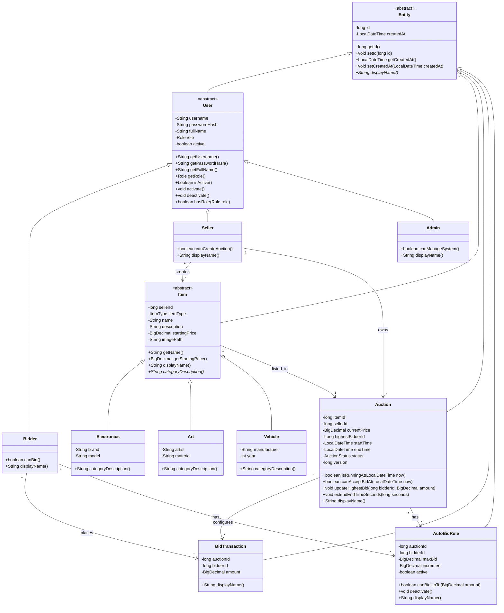

# Class Diagram - Online Auction System

This document describes the main domain model of the Online Auction System.

## 1. Main Inheritance Tree

```text
Entity (abstract)
├── User (abstract)
│   ├── Bidder
│   ├── Seller
│   └── Admin
│
├── Item (abstract)
│   ├── Electronics
│   ├── Art
│   └── Vehicle
│
├── Auction
├── BidTransaction
└── AutoBidRule
```

## 2. User Hierarchy

```text
User
├── id
├── username
├── passwordHash
├── fullName
├── role
├── active
└── createdAt
```

Subclasses:

```text
Bidder
- canBid()

Seller
- canCreateAuction()

Admin
- canManageSystem()
```

Reason:

- `User` is abstract because the system does not use a generic user directly.
- `Bidder`, `Seller`, and `Admin` have different permissions.
- This demonstrates inheritance, abstraction, and polymorphism.

## 3. Item Hierarchy

```text
Item
├── id
├── sellerId
├── itemType
├── name
├── description
├── startingPrice
├── imagePath
└── createdAt
```

Subclasses:

```text
Electronics
- brand
- model

Art
- artist
- material

Vehicle
- manufacturer
- year
```

Reason:

- `Item` is abstract because each product belongs to a concrete category.
- Subclasses override `categoryDescription()`.
- This demonstrates polymorphism.

## 4. Auction

```text
Auction
├── id
├── itemId
├── sellerId
├── currentPrice
├── highestBidderId
├── startTime
├── endTime
├── status
├── version
└── createdAt
```

Important methods:

```text
isRunningAt(now)
canAcceptBidAt(now)
updateHighestBid(bidderId, amount)
extendEndTimeSeconds(seconds)
```

State flow:

```text
OPEN → RUNNING → FINISHED → PAID
                    └──────→ CANCELED
```

## 5. BidTransaction

```text
BidTransaction
├── id
├── auctionId
├── bidderId
├── amount
└── createdAt
```

Reason:

- Every accepted bid is stored as a transaction.
- Bid history is generated from this model.

## 6. AutoBidRule

```text
AutoBidRule
├── id
├── auctionId
├── bidderId
├── maxBid
├── increment
├── active
└── createdAt
```

This is for optional Auto-Bidding.

## 7. Relationship Summary

```text
Seller 1 ---- * Item
Seller 1 ---- * Auction
Item   1 ---- 1 Auction
Auction 1 --- * BidTransaction
Bidder 1 ---- * BidTransaction
Auction 1 --- * AutoBidRule
Bidder 1 ---- * AutoBidRule
```

## 8. Design Patterns Related to Model

### Factory Method

`ItemFactory` will create concrete item objects:

```text
ItemFactory.create(...)
├── Electronics
├── Art
└── Vehicle
```

### Observer

`Auction` updates will be broadcast to subscribed clients through:

```text
BidService
→ BroadcastService
→ ClientHandler
→ JavaFX Client
```

### Singleton

Database connection manager:

```text
Database.getInstance()
```

## 9. Notes for Team Members

- Client must not access DAO or SQLite directly.
- Server services use model classes to apply business logic.
- DTO classes are used only for socket JSON transfer.
- DAO records map database rows to Java objects.

## 10. Suggested Mermaid Class Diagram

Paste this block into a Mermaid renderer or supported Markdown viewer if a visual diagram is needed.


