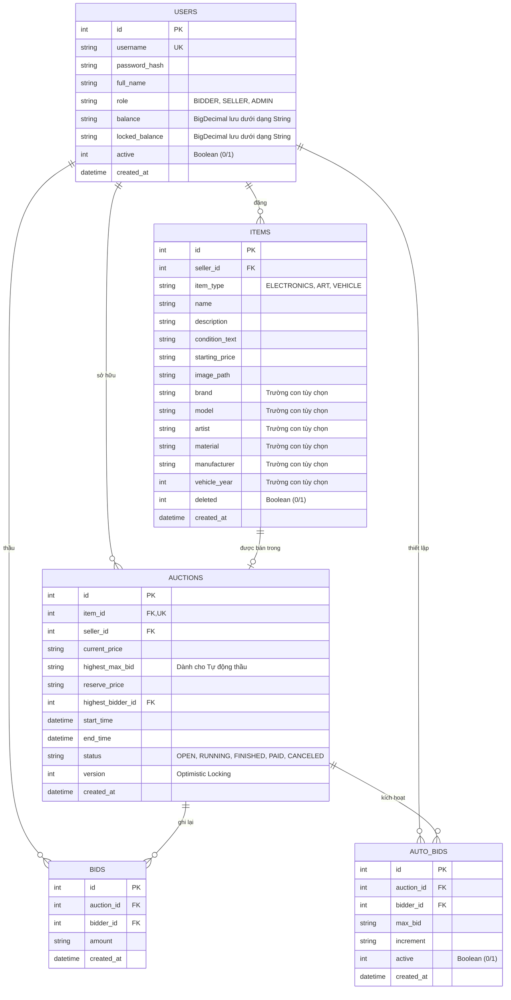

# Sơ đồ thực thể ERD & Chi tiết Cơ sở dữ liệu

Tài liệu này cung cấp cái nhìn toàn diện về tầng lưu trữ (persistence layer) của Hệ thống Đấu giá Trực tuyến.

## 1. Sơ đồ thực thể (Entity Relationship Diagram - ERD)

Cơ sở dữ liệu được xây dựng trên **SQLite** với sự tập trung vào tính toàn vẹn dữ liệu và tối ưu hóa hiệu năng.



## 2. Các Quyết định Kỹ thuật

### 2.1 Lưu trữ giá trị tiền tệ
SQLite không có kiểu dữ liệu `DECIMAL` hoặc `NUMERIC` bản ngữ để đảm bảo độ chính xác cho dữ liệu tài chính (việc sử dụng `REAL` có thể dẫn đến lỗi làm tròn dấu phẩy động).
- **Quyết định**: Tất cả các giá trị `BigDecimal` được lưu trữ dưới dạng `TEXT` trong cơ sở dữ liệu.
- **Chuyển đổi**: Ứng dụng chuyển đổi chúng ngược lại thành `java.math.BigDecimal` khi truy xuất để đảm bảo độ chính xác toán học 100%.

### 2.2 Tối ưu hóa Hiệu năng (Indexing)
Để xử lý đấu giá thời gian thực mà không bị trễ, các chỉ mục (index) sau đã được triển khai:
- `idx_items_seller_id`: Tìm kiếm nhanh các mặt hàng trong Seller Center.
- `idx_auctions_status`: Dành cho bộ lập lịch (scheduler) phía server để tìm các phiên cần đóng hoặc bắt đầu.
- `idx_bids_auction_id`: Để hiển thị nhanh lịch sử thầu và vẽ biểu đồ đường giá.
- `idx_auctions_time`: Tối ưu hóa truy vấn lọc các phiên sắp diễn ra hoặc sắp kết thúc.

### 2.3 Chế độ WAL (Write-Ahead Logging)
Server bật chế độ WAL ngay khi khởi tạo:
```sql
PRAGMA journal_mode=WAL;
```
Điều này cực kỳ quan trọng đối với hệ thống đấu giá vì nó cho phép **đọc và ghi đồng thời**. Nhiều client có thể duyệt danh sách phiên (Đọc) trong khi một người thầu đang đặt giá (Ghi) mà không gây ra lỗi "Database is locked".

### 2.4 Tính toàn vẹn & Ràng buộc
- **Khóa ngoại (Foreign Keys)**: Được bật bằng lệnh `PRAGMA foreign_keys = ON;`.
- **Xóa phân cấp (Cascading)**: Các mặt hàng sẽ bị xóa nếu người bán bị gỡ bỏ (tuy nhiên ứng dụng ưu tiên dùng soft-delete cho người dùng để giữ lại lịch sử).
- **Ràng buộc kiểm tra (Check Constraints)**: Được thực thi ở cấp độ DB cho `role` và `status` để ngăn chặn dữ liệu không hợp lệ.
@