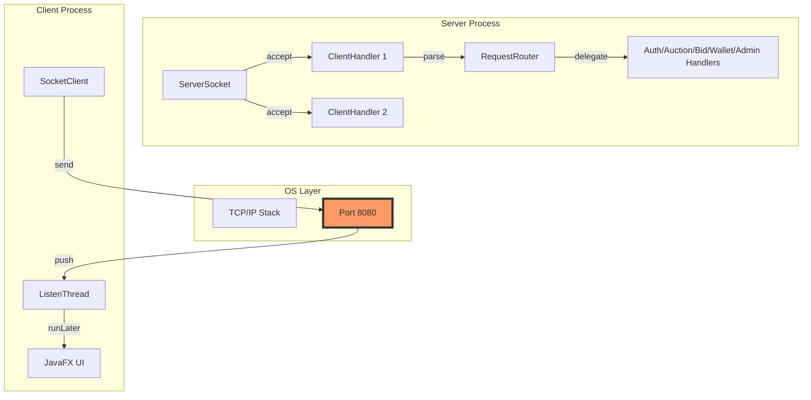

# Chủ đề 1: Kiến trúc Tổng thể & Lập trình mạng (Bản Expert)

Tài liệu này đi sâu vào "xương sống" của hệ thống. Giảng viên sẽ hỏi về cách các byte dữ liệu di chuyển và tại sao kiến trúc này lại bền vững.

---

## 1. Deep Dive: Kiến trúc Đa tầng & Module hóa

### 1.1 Tại sao dùng Maven Multi-Module?
Mở file: `pom.xml` (Gốc) và các `pom.xml` con.
- **Dependency Isolation:** `client` phụ thuộc `common`, `server` phụ thuộc `common`. Nhưng `client` KHÔNG phụ thuộc `server`.
- **Compile-time Safety:** Giúp ngăn chặn việc gọi nhầm các class chỉ dành cho Server (như DAO) từ phía Client. Nếu bạn cố tình `import com.auction.server...` trong module `client`, Maven sẽ báo lỗi ngay khi build.

### 1.2 Luồng dữ liệu (Data Flow) chi tiết đến từng hàm
Khi nhấn nút "Bid":
1. **Client UI:** `LiveBiddingController.handlePlaceBid()` lấy giá trị từ `TextField`.
2. **Client Logic:** Gọi `AuctionClientService.placeBid(auctionId, amount)`.
3. **Socket Client:** Gọi `SocketClient.sendRequest(request)`.
   - *Code:* `String json = jsonMapper.toJson(request); writer.println(json);`
4. **Mạng:** Chuỗi JSON đi qua port 8080.
5. **Server Socket:** `ServerSocket.accept()` trả về `Socket`. Một `ClientHandler` được sinh ra.
6. **Server Parsing:** `ClientHandler.run()` gọi `reader.readLine()`.
7. **Routing:** `RequestRouter.route(request)` kiểm tra request chung, replay protection, rồi `switch-case` theo `MessageType` để chuyển tiếp sang handler phù hợp.
8. **Service:** `BidService.placeBid()` xử lý logic.
9. **DAO:** `BidDao.create()` thực hiện `PreparedStatement.executeUpdate()`.

---

## 2. Lập trình Mạng "Dưới nắp capo" (Under the Hood)

### 2.1 Cơ chế Newline-delimited JSON (NDJSON)
Tại sao không dùng `jsonMapper.fromReader(reader)`?
- **Vấn đề:** Nếu dùng `fromReader`, Gson sẽ đọc cho đến khi hết Stream (khi đóng Socket). Trong khi chúng ta cần đọc từng gói tin một để xử lý liên tục.
- **Giải pháp:** `BufferedReader.readLine()` kết hợp với dấu `\n`. Đây là cách triển khai **Framing** (phân khung) đơn giản nhất trong lập trình mạng.

### 2.2 Sơ đồ Component & Network Stack



---

## 3. Kho Câu hỏi Vấn đáp "Cực khó" (Bản Expert)

### Nhóm 1: Kiến trúc (10 câu)
1. **Q: Em hãy giải thích về "Inversion of Control" (IoC) trong dự án của em?**
   - **A:** Mặc dù không dùng Spring, nhưng dự án áp dụng IoC qua việc truyền `SocketClient` vào các Controller thay vì Controller tự `new`. Điều này giúp dễ dàng thay thế `MockSocket` khi viết Test.
2. **Q: Tại sao em dùng `BigDecimal` thay vì `Double` cho tiền tệ? Chỉ ra dòng code khai báo nó?**
   - **A:** Mở `common/.../model/User.java`. `Double` bị sai số dấu phẩy động (0.1 + 0.2 != 0.3). `BigDecimal` đảm bảo độ chính xác tuyệt đối, rất quan trọng trong đấu giá.
3. **Q: Nếu Server nhận được 1 gói tin JSON bị lỗi cú pháp (ví dụ thiếu dấu ngoặc), hệ thống có bị sập không?**
   - **A:** Không. Trong `ClientHandler.run()`, em bọc lệnh parse JSON trong khối `try-catch`. Nếu lỗi, em bắt `JsonSyntaxException`, gửi trả `Response(success=false)` và tiếp tục vòng lặp chờ tin nhắn tiếp theo.
4. **Q: Cơ chế `requestId` của em có chống được tấn công Replay (gửi lại gói tin cũ) không?**
   - **A:** Có ở mức trong tiến trình server hiện tại. `RequestRouter` dùng `IdempotencyManager` để từ chối requestId đã xử lý, đồng thời client dùng `requestId` để map phản hồi về đúng `CompletableFuture`.
5. **Q: Tại sao `common` module lại không chứa bất kỳ logic nào liên quan đến Database?**
   - **A:** Để đảm bảo tính **POJO (Plain Old Java Object)**. Nó chỉ là vật chứa dữ liệu, giúp nó có thể được sử dụng ở mọi môi trường mà không kéo theo các dependency nặng nề.
6. **Q: Ý nghĩa của trường `token` trong gói tin AUTH?**
   - **A:** Khi LOGIN thành công, Server sinh UUID trả về. Client lưu lại và gửi kèm mọi Request sau đó. Server dùng nó để tra cứu `UserSession`, tránh việc phải gửi lại username/password mỗi lần thao tác (giảm nguy cơ lộ thông tin).
7. **Q: Em hãy giải thích về mô hình MVC ở phía Client? Controller liên kết với View như thế nào?**
   - **A:** View (FXML) khai báo `fx:controller="com.auction.client.controller.LoginController"`. JavaFX FXMLLoader sẽ tự động instantiate Controller và map các ID `@FXML` với các biến trong code.
8. **Q: Làm sao để đảm bảo Server không bị tràn bộ nhớ khi có hàng ngàn Client kết nối nhưng không gửi gì?**
   - **A:** `SocketServer` đã thiết lập **Read Timeout** bằng `clientSocket.setSoTimeout(600_000)`. Nếu 10 phút không gửi dữ liệu, `ClientHandler` sẽ timeout và đóng kết nối để giải phóng Thread.
9. **Q: Tại sao em lại dùng Enum cho `MessageType` thay vì String thuần?**
   - **A:** Enum cung cấp **Type-safety**. Giúp tránh lỗi gõ sai tên hành động và tận dụng được tính năng `switch-case` tối ưu của Java.
10. **Q: Em hãy mô tả cấu trúc của file `pom.xml` cha (Parent POM)?**
    - **A:** Chứa `<modules>` để định nghĩa danh sách thư mục con, và `<dependencyManagement>` để quản lý phiên bản thư viện chung (như Gson 2.10.1) cho toàn bộ dự án.

### Nhóm 2: Mạng & Giao tiếp (10 câu)
11. **Q: Socket Backlog là gì? Em có cấu hình nó không?**
    - **A:** Là độ dài hàng đợi các kết nối đang chờ `accept()`. Mặc định thường là 50. Nếu nhiều người kết nối cùng lúc hơn con số này, người sau sẽ bị từ chối ngay lập tức.
12. **Q: Giải thích cơ chế "Half-close" trong Socket?**
    - **A:** Khi một bên gọi `shutdownOutput()`, họ báo rằng tôi sẽ không gửi thêm gì nữa nhưng vẫn sẵn sàng nhận dữ liệu.
13. **Q: Tại sao dự án dùng port 8080? Nếu port này bị chiếm dụng thì sao?**
    - **A:** Đây là port chuẩn cho web thay thế. Nếu bị chiếm, Server sẽ văng `BindException: Address already in use`. Ta có thể cấu hình port trong file `application.properties`.
14. **Q: TCP Window Size ảnh hưởng thế nào đến tốc độ thầu?**
    - **A:** Nó quyết định lượng dữ liệu được gửi đi trước khi cần nhận tin nhắn xác nhận (ACK). Window size lớn giúp truyền nhanh hơn trên mạng ổn định.
15. **Q: Làm sao em xử lý tình trạng "Split Packet" (Gói tin bị chia nhỏ) trong Socket?**
    - **A:** `BufferedReader.readLine()` tự động xử lý việc này. Nó sẽ gom các mảnh dữ liệu lại cho đến khi thấy ký tự `\n` mới trả về kết quả.
16. **Q: Phân biệt `OutputStream` và `PrintWriter`? Tại sao em dùng PrintWriter?**
    - **A:** `OutputStream` làm việc với byte. `PrintWriter` là một lớp bọc (Wrapper) làm việc với ký tự, cung cấp hàm `println()` rất tiện lợi cho giao thức NDJSON.
17. **Q: Client lắng nghe tin nhắn từ Server bằng luồng nào? Tại sao phải dùng luồng riêng?**
    - **A:** Dùng `Thread` riêng trong `SocketClient`. Vì `readLine()` là lệnh chặn (blocking), nếu dùng luồng UI để lắng nghe, toàn bộ giao diện sẽ bị "đóng băng" (Not Responding).
18. **Q: Nagle's Algorithm là gì? Tại sao trong đấu giá người ta thường tắt nó (`TCP_NODELAY`)?**
    - **A:** Thuật toán Nagle trì hoãn việc gửi các gói tin nhỏ để gom lại thành gói lớn. Trong đấu giá, chúng ta cần gửi giá thầu NGAY LẬP TỨC nên thường set `socket.setTcpNoDelay(true)`.
19. **Q: Em hãy giải thích về cơ chế Serialization của Gson?**
    - **A:** Gson dùng **Reflection** để quét các trường của Object, lấy giá trị và format chúng thành chuỗi văn bản theo chuẩn JSON.
20. **Q: Tại sao em lại gửi `timestamp` từ Server về Client?**
    - **A:** Để đồng bộ hiển thị. Client có thể lệch giờ so với Server, nên mọi tính toán thời gian (đếm ngược) phải dựa trên mốc giờ do Server (Trọng tài) cung cấp.

---

## 4. Giải mã Code (Code Walkthrough)

### File: `server/src/main/java/com/auction/server/socket/ClientHandler.java`
Giảng viên hỏi: "Chỉ cho tôi dòng code đọc dữ liệu từ mạng?"
```java
// Khoảng dòng 40-50
String line = reader.readLine(); // Chờ và đọc 1 dòng JSON
if (line != null) {
    Request req = jsonMapper.fromJson(line, Request.class);
    // ... xử lý
}
```

### File: `common/src/main/java/com/auction/common/util/JsonMapper.java`
Giảng viên hỏi: "Tại sao em phải viết class riêng để bọc Gson?"
```java
// Chỗ này cấu hình các TypeAdapter đặc biệt
public JsonMapper() {
    this.gson = new GsonBuilder()
        .registerTypeAdapter(LocalDateTime.class, new LocalDateTimeAdapter()) // Xử lý ngày tháng
        .create();
}
```
*Lý do:* Mặc định Gson không biết cách biến `LocalDateTime` thành JSON. Chúng ta phải đăng ký Adapter để định dạng nó thành chuỗi "yyyy-MM-dd HH:mm:ss".
