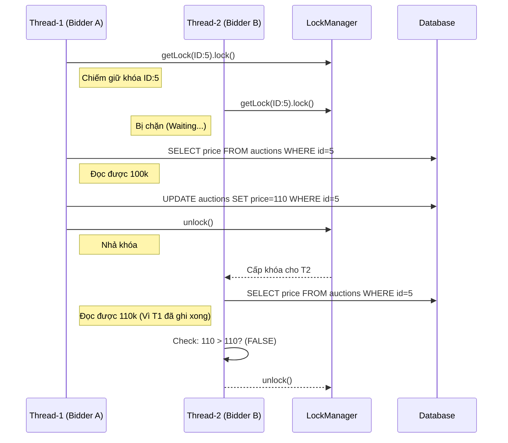

# Chủ đề 2: Xử lý Đa luồng (Concurrency) & Đồng bộ hóa (Bản Expert)

Đây là chương "đắt giá" nhất. Giảng viên sẽ kiểm tra xem bạn có thực sự làm chủ được các luồng chạy song song hay chỉ đang gặp may.

---

## 1. Deep Dive: Memory Model & Visible Problem

### 1.1 Vấn đề bộ nhớ CPU (Caching)
Mọi biến trong Java (như `currentPrice`) thực tế được CPU copy từ RAM vào Cache riêng của từng Core để xử lý cho nhanh.
- **Vấn đề:** Thread A sửa giá lên 150k. Thread B ở Core khác vẫn đọc giá từ Cache của nó là 100k.
- **Giải pháp trong code:** Sử dụng `ReentrantLock`. Khi một luồng lấy được Lock, Java Memory Model (JMM) đảm bảo toàn bộ dữ liệu cũ trong Cache sẽ bị xóa và nạp lại từ RAM chính (Happens-before guarantee).

### 1.2 Tại sao lại dùng `ConcurrentHashMap` thay vì `synchronized Map`?
Mở file: `AuctionLockManager.java`
- `synchronized Map` khóa TOÀN BỘ cái map khi có bất kỳ ai truy cập.
- `ConcurrentHashMap` dùng kỹ thuật **CAS (Compare-And-Swap)** và phân đoạn khóa. Giúp hàng ngàn người có thể xin cấp Lock cho các `auctionId` khác nhau mà không hề phải đợi nhau ở cửa Map.

---

## 2. Giải mã Logic "Sống còn": `BidService.placeBid`

Đây là đoạn code quan trọng nhất toàn dự án.



---

## 3. Kho Câu hỏi Vấn đáp "Hacks/Tricky" (Bản Expert)

### Nhóm 1: Java Multithreading (10 câu)
1. **Q: Phân biệt `Runnable` và `Callable`? Nhóm dùng loại nào?**
   - **A:** `Runnable` không trả về kết quả. `Callable` có thể trả về `Future` và ném ra Checked Exception. Nhóm dùng `Runnable` cho `ClientHandler`.
2. **Q: `Thread.interrupt()` làm nhiệm vụ gì? Nó có giết chết luồng ngay lập tức không?**
   - **A:** Không. Nó chỉ gắn một "lá cờ" hiệu (flag). Code bên trong luồng phải chủ động kiểm tra cờ này để tự dừng lại một cách êm đẹp (Graceful shutdown).
3. **Q: Em hãy giải thích về AbstractQueuedSynchronizer (AQS)?**
   - **A:** Đây là khung xương bên dưới của `ReentrantLock`. Nó sử dụng một biến `state` (số lần khóa) và một hàng đợi các luồng đang chờ (Wait Queue).
4. **Q: Điều gì xảy ra nếu em quên gọi `unlock()` trong một hàm đệ quy?**
   - **A:** Sẽ gây ra **Memory Leak** và **Deadlock**. `ReentrantLock` hỗ trợ tái nhập, nên mỗi lần gọi nó sẽ tăng `hold count`. Phải `unlock` đúng số lần đó thì khóa mới thực sự mở.
5. **Q: Làm sao để phát hiện một luồng đang bị Deadlock trong môi trường Production?**
   - **A:** Sử dụng lệnh `jstack` hoặc các công cụ APM để quét đồ thị vòng lặp của các luồng đang giữ Lock.
6. **Q: Tại sao `wait()` và `notify()` phải nằm trong khối `synchronized`?**
   - **A:** Vì chúng yêu cầu quyền kiểm soát Monitor của đối tượng đó. Nếu không có Lock mà gọi `wait`, JVM sẽ ném `IllegalMonitorStateException`.
7. **Q: Phân biệt `Fair Lock` và `Non-fair Lock`?**
   - **A:** Fair Lock: Ai đến trước được trước (FIFO). Non-fair: Cho phép luồng mới nhảy xổ vào lấy Lock nếu nó may mắn (Performance cao hơn).
8. **Q: `volatile` có đảm bảo tính nguyên tử cho kiểu `long` và `double` 64-bit không?**
   - **A:** Có, kể từ Java 8, `volatile` đảm bảo việc đọc/ghi các kiểu 64-bit là nguyên tử (không bị hiện tượng đọc nửa chừng).
9. **Q: "Thread Leak" là gì? Làm sao em phòng tránh?**
   - **A:** Là khi tạo ra Thread mà không bao giờ đóng lại. Phòng tránh bằng cách dùng **Thread Pool** với giới hạn số lượng luồng.
10. **Q: Ý nghĩa của hàm `Thread.yield()`?**
    - **A:** Gợi ý cho hệ điều hành rằng luồng này sẵn sàng nhường CPU cho luồng khác có cùng độ ưu tiên.

### Nhóm 2: Concurrency trong Dự án (10 câu)
11. **Q: Tại sao em không dùng `synchronized` ở `BidDao.java`?**
    - **A:** Vì DAO nên là stateless (không trạng thái). Việc đồng bộ nên nằm ở lớp Service để quản lý logic nghiệp vụ cao hơn.
12. **Q: Em xử lý việc tranh chấp Lock giữa nạp tiền (Deposit) và thầu (Bid) như thế nào?**
    - **A:** Em dùng khóa theo `userId`. Khi thầu, hệ thống khóa cả `auctionId` (để tránh người khác thầu đè) và `userId` (để trừ tiền an toàn).
13. **Q: Nếu hàng triệu người dùng cùng lúc, `ConcurrentHashMap` của LockManager có bị chậm không?**
    - **A:** Nó cực kỳ nhanh vì nó khóa theo từng "bin". Tuy nhiên, nếu có hàng triệu Key, ta cần cân nhắc việc xóa bớt các Lock không còn dùng (đã kết thúc đấu giá).
14. **Q: `Platform.runLater` thực chất là dùng Pattern gì?**
    - **A:** Dùng **Producer-Consumer Pattern**. Luồng mạng là Producer đẩy yêu cầu vào queue, luồng JavaFX là Consumer lấy ra chạy.
15. **Q: Em hãy chỉ ra dòng code nào thực hiện việc chờ đợi luồng khác nhả Lock?**
    - **A:** Dòng `lock.lock();` trong `BidService`. Lệnh này sẽ block luồng hiện tại cho đến khi lấy được khóa.
16. **Q: Tại sao nhóm không dùng `CompletableFuture`?**
    - **A:** Có dùng ở phía Client để xử lý bất đồng bộ các Request gửi lên Server mà không làm đứng UI.
17. **Q: Làm sao em test được kịch bản 2 luồng cùng thầu ở miligiây thứ 500?**
    - **A:** Dùng `CyclicBarrier`. Cho 2 luồng chờ ở barrier, khi đủ cả 2 thì cùng "bung" ra gọi hàm `placeBid`.
18. **Q: Ý nghĩa của `lock.lockInterruptibly()`?**
    - **A:** Giúp ta có thể thoát khỏi trạng thái chờ Lock nếu người dùng nhấn nút "Cancel" trên UI.
19. **Q: Em hãy giải thích về "False Sharing" trong Cache CPU?**
    - **A:** Khi 2 biến nằm gần nhau trên cùng một Cache Line. Việc sửa biến A làm CPU phải nạp lại cả cụm chứa biến B, gây chậm hệ thống.
20. **Q: Tại sao lại dùng `TimeUnit.SECONDS` trong các hàm chờ?**
    - **A:** Giúp code tường minh và dễ đọc hơn thay vì dùng các số miligiây khô khan.

### Nhóm 3: Những câu hỏi "Vắt kiệt" kiến thức (10 câu)
21. **Q: Em hãy trình bày cấu trúc của `Condition` trong ReentrantLock?**
22. **Q: `StampedLock` khác gì ReentrantLock? Tại sao nhóm không dùng?**
    - **A:** StampedLock hỗ trợ Optimistic Read cực nhanh nhưng phức tạp và không hỗ trợ reentrancy.
23. **Q: Làm sao em đảm bảo tính nhất quán (Consistency) giữa Cache của Java và Database SQLite?**
    - **A:** Luôn đọc dữ liệu mới nhất từ DB bên trong khối Lock.
24. **Q: "Spurious Wakeup" là gì?**
    - **A:** Hiện tượng luồng đang `wait()` tự nhiên thức dậy mà không có ai `notify`. Ta phải dùng vòng lặp `while` để kiểm tra lại điều kiện.
25. **Q: JVM quản lý các luồng như thế nào ở mức OS?**
    - **A:** Trên Windows/Linux hiện đại, 1 Java Thread ánh xạ trực tiếp sang 1 Native OS Thread.
26. **Q: Tại sao `stop()` và `destroy()` bị gạch bỏ (Deprecated)?**
27. **Q: Em hãy giải thích về "Thread Starvation"?**
28. **Q: Làm sao để chuyển một luồng từ trạng thái WAITING sang RUNNABLE?**
29. **Q: Có bao nhiêu loại Thread Pool chính trong Java?**
    - **A:** Fixed, Cached, Scheduled, Single. Nhóm dùng Fixed cho Server.
30. **Q: Tại sao không nên khởi tạo Lock mới trong mỗi Request?**
    - **A:** Vì như vậy 2 luồng sẽ giữ 2 đối tượng Lock khác nhau, không có tác dụng bảo vệ vùng nhớ chung. Bắt buộc phải lấy từ Map dùng chung.

---

## 4. Giải mã Code (Code Walkthrough)

### File: `server/src/main/java/com/auction/server/concurrency/AuctionLockManager.java`
Dòng code "Ma thuật":
```java
public ReentrantLock getLock(long auctionId) {
    // computeIfAbsent đảm bảo việc tạo lock là nguyên tử (Atomic)
    return locks.computeIfAbsent(auctionId, id -> new ReentrantLock());
}
```
*Tại sao không dùng `if(!locks.containsKey(id)) locks.put(id, new Lock())`?*
Vì nếu 2 luồng cùng chạy lệnh `if`, cả 2 đều thấy chưa có Lock, cả 2 cùng tạo 2 Lock mới -> 2 luồng cùng thầu thành công (Race Condition). `computeIfAbsent` giải quyết triệt để lỗi này.

### File: `server/src/main/java/com/auction/server/service/BidService.java`
Dòng code "Sống còn":
```java
lock.lock(); // Bước 1: Chiếm giữ lãnh thổ
try {
    // Bước 2: Thực thi trong an toàn
    validateAndSaveBid(...);
} finally {
    lock.unlock(); // Bước 3: Luôn luôn nhả khóa, dù có sập app
}
```
*Hỏi:* Tại sao không để `unlock()` ngay sau `validateAndSaveBid`?
*Đáp:* Vì nếu hàm đó ném ra `RuntimeException`, lệnh `unlock` sẽ bị nhảy qua, khóa bị kẹt mãi mãi. `finally` là cứu cánh duy nhất.
