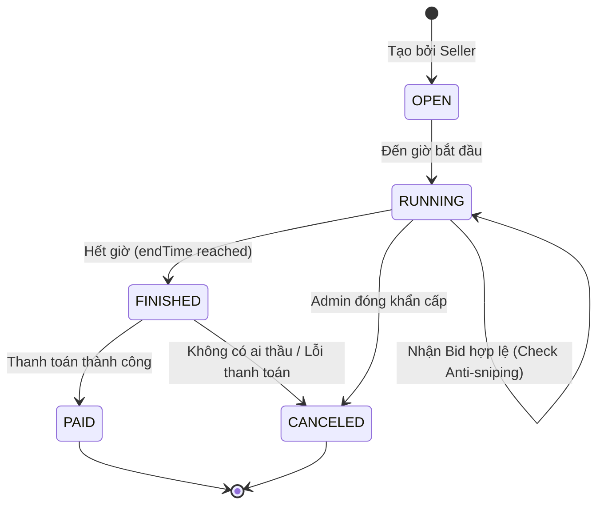

# Chủ đề 4: Thuật toán Nâng cao & Logic (Bản Expert)

Tài liệu này giải mã những "bí mật" đằng sau các thuật toán thông minh của hệ thống. Bạn cần chứng minh được sự tối ưu và tính chính xác của giải thuật.

---

## 1. Deep Dive: Thuật toán Auto-Bidding (Proxy Bidding)

### 1.1 Tại sao phải tối ưu O(1)?
Nếu có 2 người cùng đặt Auto-bid, giả sử người A đặt tối đa 1 triệu, người B đặt tối đa 2 triệu.
- **Cách làm dở:** Server chạy vòng lặp, mỗi lần tăng 10k. 
  - *Hậu quả:* Nếu khoảng cách giá lớn, Server sẽ bị treo (CPU spike) và Database bị nã hàng ngàn lệnh Update vô ích.
- **Cách làm của nhóm:** So sánh trực tiếp giá trị tối đa (`maxBid`).
  - *Công thức:* `CurrentPrice = Math.min(MaxBid_A, MaxBid_B) + increment`.
  - *Người thắng:* Người có `MaxBid` lớn hơn.

### 1.2 Luồng xử lý (Activity Diagram)

```mermaid
activityDiagram
    start
    :Nhận Bid tay (Manual Bid) giá X;
    :Lấy danh sách Auto-bid đang hoạt động;
    if (Có luật Auto-bid không?) then (Có)
        :Tìm Max_1 (cao nhất) và Max_2 (cao nhì);
        if (X > Max_1) then (X thắng)
            :Set giá = X;
            :Winner = Manual User;
        else (Auto thắng)
            :Set giá = Max(X, Max_2) + increment;
            :Winner = User_Max_1;
        end
    else (Không)
        :Set giá = X;
        :Winner = Manual User;
    endif
    :Ghi log giao dịch;
    :Broadcast Realtime;
    stop
```

---

## 2. Deep Dive: Anti-Sniping & Trạng thái Phiên

### 2.1 Thuật toán gia hạn thời gian
Mở file: `AuctionService.java`
- **Logic:** `if (Duration.between(now, endTime).toSeconds() < 30) { endTime += 60s }`.
- **Rủi ro:** Liệu có bị gia hạn vô hạn không?
  - *Đáp:* Không. Vì mỗi lần thầu giá phải tăng lên. Đến một lúc nào đó, không ai muốn trả thêm tiền nữa, phiên đấu giá sẽ tự đóng. Đây là cơ chế tự cân bằng của thị trường.

### 2.2 Sơ đồ trạng thái (State Diagram) - Chi tiết



---

## 3. Kho Câu hỏi Vấn đáp "Hacks/Tricky" (Bản Expert)

### Nhóm 1: Logic Đấu giá (10 câu)
1. **Q: Sự khác biệt giữa `Reserve Price` và `Starting Price`?**
   - **A:** Starting Price là giá khởi điểm. Reserve Price là giá tối thiểu người bán kỳ vọng. Nếu đấu giá xong mà chưa chạm Reserve Price, Seller có quyền không bán.
2. **Q: Làm sao em xử lý việc nạp tiền ảo (Money laundering)?**
   - **A:** Trong bài tập lớn, chúng em giả định số dư được nạp từ hệ thống bên ngoài tin cậy. Ở thực tế, cần tích hợp Payment Gateway (VNPAY/MoMo).
3. **Q: Người dùng có thể đặt `startTime` trong quá khứ không?**
   - **A:** Không. Hệ thống validate: `startTime > now()`. Nếu không sẽ ném ra `InvalidAuctionException`.
4. **Q: Tại sao em lại lưu `highest_max_bid` trong DB thay vì chỉ lưu `current_price`?**
   - **A:** Để hệ thống biết giới hạn của người đang dẫn đầu, từ đó tự động phản hồi lại các cú thầu của người khác (Proxy Bidding).
5. **Q: Điều gì xảy ra nếu Admin xóa sản phẩm trong khi nó đang được đấu giá?**
   - **A:** Nhóm sử dụng **Soft Delete** (`deleted = 1`). Phiên đấu giá vẫn tiếp tục hoặc bị hủy (Cancel) tùy thuộc vào quyền của Admin, nhưng dữ liệu lịch sử không bị mất.
6. **Q: Làm sao em đảm bảo tính công bằng khi mạng của người dùng bị lag?**
   - **A:** Chính thuật toán **Anti-sniping** là giải pháp. Nó cho người bị lag thêm 60 giây để phản kháng nếu có cú "bắn tỉa" giây cuối.
7. **Q: Ý nghĩa của trường `version` trong bảng `auctions`?**
   - **A:** Dùng cho **Optimistic Locking**. Để chắc chắn khi Server cập nhật giá, không có luồng nào khác đã sửa nó trước đó (nhằm bảo vệ Database Integrity).
8. **Q: Tại sao em lại dùng `java.time.Instant` cho thời gian?**
   - **A:** Vì `Instant` đại diện cho một điểm duy nhất trên dòng thời gian UTC, không bị phụ thuộc vào múi giờ của máy tính cài App.
9. **Q: Làm sao em xử lý đấu giá kết thúc vào lúc nửa đêm khi không có Admin nào trực?**
   - **A:** Hệ thống dùng **Scheduled Task** (luồng chạy tự động). Nó tự đóng phiên và xác định người thắng mà không cần con người can thiệp.
10. **Q: "Winner's Curse" là gì? Hệ thống của em có cảnh báo người dùng không?**
    - **A:** Là hiện tượng người thắng trả giá quá cao so với giá trị thực. Biểu đồ giá trực tuyến chính là công cụ giúp người dùng tỉnh táo hơn khi thấy giá leo thang quá nhanh.

### Nhóm 2: Thuật toán & Hiệu năng (10 câu)
11. **Q: Em hãy giải thích thuật toán sắp xếp danh sách Auction theo độ "Hot"?**
    - **A:** Độ hot = (Số lượng bid) / (Thời gian còn lại). Các phiên sắp kết thúc và có nhiều người tranh giành sẽ được đẩy lên đầu.
12. **Q: Tại sao biểu đồ giá của em lại dùng `Platform.runLater`?**
    - **A:** Vì dữ liệu bid mới đến từ luồng Socket. Nếu vẽ biểu đồ trực tiếp từ luồng đó, JavaFX sẽ crash.
13. **Q: Nếu 2 người cùng đặt Auto-bid với `maxBid` giống hệt nhau, ai thắng?**
    - **A:** Người đặt TRƯỚC (theo timestamp trong bảng `auto_bids`) sẽ thắng.
14. **Q: Thuật toán tính toán `secondsLeft` của em có bị ảnh hưởng bởi giây nhuận không?**
15. **Q: Làm sao em gửi thông báo "Bạn đã bị vượt giá" (Outbid) chỉ cho đúng người đó?**
    - **A:** Server tra cứu `clientId` của người giữ giá cao nhất cũ trong `NotificationService` và gửi một gói tin JSON riêng biệt tới họ.
16. **Q: "Floating Point Error" ảnh hưởng thế nào đến thuật toán chia tiền hoa hồng cho Seller?**
    - **A:** Sẽ gây thất thoát tiền. Đó là lý do em dùng `BigDecimal` và phương thức `setScale(2, RoundingMode.HALF_UP)`.
17. **Q: Em hãy mô tả cấu trúc dữ liệu của `BidHistory` trên Client?**
    - **A:** Dùng `ObservableList`. Khi có bid mới, em chỉ cần add vào list, UI (TableView) sẽ tự động cập nhật nhờ cơ chế **Data Binding**.
18. **Q: Làm sao để biểu đồ giá không bị "giật" khi cập nhật?**
    - **A:** Tắt hoạt ảnh (Animation) của `LineChart` khi thêm điểm dữ liệu mới, hoặc dùng một bộ đệm nhỏ.
19. **Q: "Anti-sniping" có thể bị lạm dụng để kéo dài phiên mãi mãi không?**
    - **A:** Về lý thuyết là có, nhưng thực tế giá sẽ tăng đến mức không ai muốn thầu nữa. Ta cũng có thể giới hạn tối đa 5 lần gia hạn.
20. **Q: Ý nghĩa của hàm `BigDecimal.compareTo()` so với toán tử `==`?**
    - **A:** `==` so sánh tham chiếu. `compareTo` so sánh giá trị toán học (1.0 compareTo 1.00 trả về 0, nhưng equals trả về false).

### Nhóm 3: Những câu hỏi "Cân não" (10 câu)
21. **Q: Giải thích thuật toán "Dutch Auction" (Đấu giá ngược)?**
22. **Q: Làm sao em đảm bảo tính nguyên tử (Atomicity) khi thực hiện Auto-bid?**
    - **A:** Toàn bộ logic so sánh và đặt giá cho người thắng Auto-bid phải nằm trong cùng một Database Transaction.
23. **Q: Tại sao em không dùng Redis để lưu giá hiện tại cho nhanh?**
    - **A:** Với quy mô bài tập lớn, SQLite là đủ. Nếu mở rộng, Redis là lựa chọn tuyệt vời để giảm tải cho DB chính.
24. **Q: Em hãy chỉ ra dòng code thực hiện việc cộng tiền cho Seller khi đấu giá kết thúc?**
25. **Q: Làm sao em xử lý tình huống "Lệch giờ" (Clock Skew) giữa 2 máy Server trong cụm?**
    - **A:** Dùng giao thức NTP để đồng bộ giờ máy chủ. Trong dự án này chỉ có 1 Server nên không lo ngại.
26. **Q: "Price Sniping" có phải luôn luôn là xấu không?**
27. **Q: Em xử lý thế nào nếu người dùng nhập `maxBid` là một con số khổng lồ (ví dụ 100 tỷ tỷ)?**
    - **A:** Sử dụng kiểu dữ liệu `DECIMAL(20, 2)` trong DB và `BigDecimal` trong Java để tránh tràn số (Overflow).
28. **Q: Ý nghĩa của việc "Phong tỏa tiền" (Locked Balance)?**
    - **A:** Để chắc chắn khi thắng, người dùng có đủ tiền trả. Nếu không phong tỏa, họ có thể dùng tiền đó đi thầu sản phẩm khác.
29. **Q: Làm sao em biết một `token` đã bị thu hồi (Revoked)?**
30. **Q: "Bid Shielding" là gì? Hệ thống của em chống lại nó như thế nào?**

---

## 4. Giải mã Code (Code Walkthrough)

### File: `server/src/main/java/com/auction/server/service/BidService.java` (Logic Auto-bid)
```java
// Đoạn code tính toán giá tiếp theo
BigDecimal nextBid;
if (manualBid.compareTo(autoBid.getMaxBid()) < 0) {
    // Nếu giá tay vẫn thấp hơn mức trần của Auto
    nextBid = manualBid.add(auction.getIncrement());
    if (nextBid.compareTo(autoBid.getMaxBid()) > 0) {
        nextBid = autoBid.getMaxBid(); // Không vượt quá mức trần
    }
}
```
*Hỏi:* Tại sao lại có lệnh `if (nextBid > maxBid) nextBid = maxBid`?
*Đáp:* Để đảm bảo hệ thống luôn tôn trọng mức giá tối đa mà người dùng đã thiết lập, không bao giờ đặt giá cao hơn ví tiền của họ.

### File: `client/src/main/java/com/auction/client/util/PriceChartManager.java`
```java
public void addDataPoint(String time, double price) {
    Platform.runLater(() -> {
        series.getData().add(new XYChart.Data<>(time, price));
        // Giới hạn 20 điểm hiển thị để biểu đồ không quá khít
        if (series.getData().size() > 20) {
            series.getData().remove(0);
        }
    });
}
```
*Hỏi:* Tại sao em lại xóa điểm dữ liệu cũ (`remove(0)`)?
*Đáp:* Đây là kỹ thuật **Sliding Window**. Nó giúp biểu đồ trông giống như đang cuộn từ phải sang trái, giữ cho giao diện luôn thoáng đạt và dễ nhìn.
