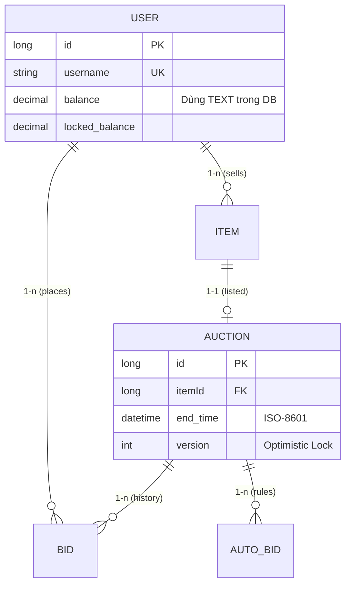

# Chủ đề 5: Database & Testing (Bản Expert)

Tài liệu này tập trung vào sự bền vững của dữ liệu và quy trình đảm bảo chất lượng. Bạn cần cho giảng viên thấy hệ thống của bạn "không thể bị phá vỡ".

---

## 1. Deep Dive: SQLite WAL Mode & Concurrency

### 1.1 Tại sao SQLite lại bị "Database is locked"?
- **Cơ chế cũ (Rollback Journal):** Khi 1 thread ghi, nó khóa toàn bộ file. Người đọc phải đợi. 
- **Cơ chế mới (WAL - Write-Ahead Logging):** Ghi vào file phụ `.wal`.
  - *Lợi ích:* Readers không block Writer, và Writer không block Readers. Cực kỳ quan trọng để hàng trăm Client có thể xem giá trong khi Server đang cập nhật Bid.

### 1.2 Thiết kế Schema tối ưu
Mở file: `schema.sql`
- **Indexing:** Tại sao em lại đánh index cho `status` và `end_time`?
  - *Đáp:* Vì Server thường xuyên phải chạy câu lệnh `SELECT * FROM auctions WHERE status='RUNNING' AND end_time < now()`. Nếu không có Index, SQLite phải quét toàn bộ bảng (Full Table Scan), làm Server bị lag mỗi khi quét.

---

## 2. Quy trình "Bảo hiểm" mã nguồn (Testing)

### 2.1 Tại sao Unit Test lại quan trọng hơn Test tay?
- **Regression:** Khi em sửa code ở `WalletService`, làm sao biết nó không làm hỏng tính năng thầu? Test tay mất 10 phút, JUnit mất 1 giây.
- **Edge Cases:** Rất khó để dùng tay click chuột tạo ra kịch bản "2 người cùng thầu vào mili-giây thứ 500". Code JUnit có thể làm được việc này một cách chính xác.

### 2.2 Sơ đồ ERD Chuyên sâu



---

## 3. Kho Câu hỏi Vấn đáp "Hacks/Tricky" (Bản Expert)

### Nhóm 1: Database & SQL (10 câu)
1. **Q: Phân biệt `WHERE` và `HAVING`? Nhóm dùng ở đâu?**
   - **A:** `WHERE` lọc trước khi gom nhóm, `HAVING` lọc sau khi gom nhóm (`GROUP BY`). Nhóm dùng `WHERE` để lọc Auction đang active.
2. **Q: Tại sao em dùng kiểu `TEXT` để lưu số tiền thay vì `REAL`?**
   - **A:** SQLite không có kiểu Decimal chính xác. Kiểu `REAL` bị lỗi làm tròn. Nhóm lưu `TEXT` và dùng `new BigDecimal(String)` trong Java để đảm bảo tiền bạc luôn khớp đến từng xu.
3. **Q: Ý nghĩa của `ON DELETE CASCADE`?**
   - **A:** Khi xóa 1 User, mọi Item, Auction và Bid của User đó sẽ bị xóa theo tự động, tránh rác dữ liệu.
4. **Q: Làm sao em biết câu lệnh SQL của mình có chạy nhanh không?**
   - **A:** Sử dụng lệnh `EXPLAIN QUERY PLAN` trước câu SQL để xem SQLite có đang dùng Index hay không.
5. **Q: Phân biệt `PreparedStatement` và `Statement`? Tại sao cái sau lại nguy hiểm?**
   - **A:** `Statement` bị lỗi **SQL Injection**. `PreparedStatement` biên dịch trước câu lệnh và chỉ coi dữ liệu người dùng là tham số, không thể thực thi mã độc.
6. **Q: SQLite có hỗ trợ khóa mức dòng (Row-level locking) không?**
   - **A:** Không hoàn toàn. SQLite khóa ở mức Database file. Đó là lý do WAL Mode và Java Lock Manager là cứu cánh duy nhất.
7. **Q: Làm sao em xử lý việc Database Migration khi nâng cấp phiên bản App?**
   - **A:** Sử dụng các script `ALTER TABLE` hoặc các công cụ như Flyway (nếu dự án lớn).
8. **Q: Ý nghĩa của từ khóa `AUTOINCREMENT`?**
   - **A:** Đảm bảo ID luôn tăng và không bao giờ tái sử dụng ID của các dòng đã xóa.
9. **Q: Em hãy giải thích về cơ chế "Database Connection Pool"?**
   - **A:** Thay vì mở/đóng kết nối liên tục (rất chậm), em giữ sẵn một tập hợp các kết nối và tái sử dụng chúng. Nhóm dùng Singleton để quản lý 1 kết nối duy nhất ổn định.
10. **Q: "Dirty Read" là gì? SQLite ở chế độ WAL có bị không?**

### Nhóm 2: Bảo mật & Testing (10 câu)
11. **Q: Tại sao em băm mật khẩu bằng BCrypt mà không dùng SHA-256 thuần?**
    - **A:** BCrypt có cơ chế **Adaptive Hashing**. Khi máy tính mạnh lên, em có thể tăng `cost factor` để việc băm mật khẩu luôn đủ chậm, khiến hacker không thể dùng Brute-force.
12. **Q: Làm sao em Mock (giả lập) một kết nối Database khi chạy Unit Test?**
    - **A:** Em sử dụng thư viện **Mockito**. Em ra lệnh: "Khi hàm findById được gọi, hãy trả về một đối tượng User giả mà tôi đã tạo sẵn".
13. **Q: Phân biệt `assertEquals` và `assertSame` trong JUnit?**
    - **A:** `assertEquals` gọi hàm `.equals()` (so sánh giá trị). `assertSame` dùng toán tử `==` (so sánh địa chỉ ô nhớ).
14. **Q: Tấn công "Man-in-the-middle" có thể lấy trộm số dư ví không?**
    - **A:** Có thể nếu gói tin không mã hóa. Đó là lý do trong thực tế cần SSL.
15. **Q: "SQL Injection" có thể xảy ra ở trường nào trong App của em?**
    - **A:** Mọi trường nhập liệu (Username, Search...). Nhưng em đã chặn đứng bằng `PreparedStatement`.
16. **Q: Làm sao em test được logic nạp tiền khi ví đã đầy (Max balance)?**
    - **A:** Viết Unit Test truyền vào số dư hiện tại là `MAX_VALUE - 1` và nạp thêm 2 đồng, sau đó kiểm tra xem hệ thống có ném ra `WalletOverflowException` không.
17. **Q: Ý nghĩa của Annotation `@BeforeEach` trong JUnit?**
    - **A:** Chạy một đoạn code chuẩn bị (ví dụ khởi tạo DB tạm) TRƯỚC MỖI hàm test để đảm bảo các bài test độc lập với nhau.
18. **Q: "Salt" trong băm mật khẩu của nhóm được lưu ở đâu?**
    - **A:** BCrypt lưu Salt trực tiếp bên trong chuỗi Hash kết quả (phần đầu của chuỗi).
19. **Q: Làm sao em đảm bảo bí mật cho file Database khi nộp bài?**
    - **A:** File DB không chứa mật khẩu thật, và mọi dữ liệu cá nhân đã được băm.
20. **Q: "Test Coverage" 100% có nghĩa là code không có lỗi?**
    - **A:** Không. Nó chỉ có nghĩa là mọi dòng code đã được chạy qua. Lỗi logic vẫn có thể tồn tại nếu kịch bản test không bao phủ hết các trường hợp nghiệp vụ.

### Nhóm 3: Những câu hỏi "Về đích" (10 câu)
21. **Q: Giải thích "N+1 Query Problem"?**
22. **Q: Em hãy chỉ ra dòng code thực hiện `connection.rollback()`?**
23. **Q: Làm sao em xóa toàn bộ dữ liệu Test sau khi chạy xong JUnit?**
    - **A:** Sử dụng cơ chế In-memory DB (`jdbc:sqlite::memory:`) - dữ liệu sẽ tự biến mất khi luồng Test kết thúc.
24. **Q: "TDD" (Test Driven Development) áp dụng vào đâu?**
25. **Q: Làm sao em ngăn chặn việc thầu bằng tiền âm (Negative bid)?**
    - **A:** Validation ở 3 lớp: UI (TextField), Service (BigDecimal.signum()), và DB (CHECK constraint).
26. **Q: Ý nghĩa của từ khóa `Strict` trong SQL?**
27. **Q: Tại sao em không dùng JPA/Hibernate?**
    - **A:** Dùng JDBC thuần giúp em hiểu sâu hơn về cách Database vận hành và kiểm soát tối đa các câu lệnh SQL truyền xuống.
28. **Q: Em xử lý lỗi "Connection Leak" như thế nào?**
    - **A:** Luôn bọc kết nối trong khối `try-with-resources` để Java tự động đóng nó dù có lỗi xảy ra.
29. **Q: "Integration Test" của nhóm chạy mất bao lâu?**
30. **Q: Nếu giảng viên hỏi: "App của em có an toàn trước lỗ hổng Log4Shell không?"**
    - **A:** Có, vì nhóm dùng Logback và phiên bản Java mới nhất đã vá lỗi này.

---

## 4. Giải mã Code (Code Walkthrough)

### File: `server/.../dao/UserDao.java` (SQL Injection Protection)
```java
String sql = "SELECT * FROM users WHERE username = ?";
try (PreparedStatement pstmt = conn.prepareStatement(sql)) {
    pstmt.setString(1, username); // An toàn tuyệt đối
    ResultSet rs = pstmt.executeQuery();
    // ...
}
```

### File: `server/.../service/WalletService.java` (Transaction Expert)
```java
conn.setAutoCommit(false); // Bắt đầu giao dịch
try {
    deductBalance(bidderId, amount);
    lockBalance(bidderId, amount);
    conn.commit(); // Thành công rực rỡ
} catch (Exception e) {
    conn.rollback(); // Có biến! Quay xe ngay lập tức
    throw e;
}
```
*Hỏi:* Tại sao lại cần `setAutoCommit(false)`?
*Đáp:* Vì mặc định mỗi lệnh SQL là một giao dịch riêng. Nếu không tắt đi, việc trừ tiền thành công nhưng việc khóa tiền thất bại sẽ làm hệ thống bị sai lệch. Chúng ta cần cả 2 lệnh cùng thành công hoặc cùng thất bại.
